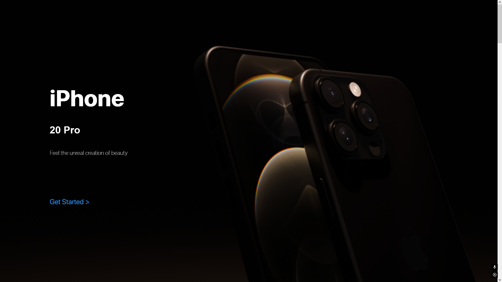
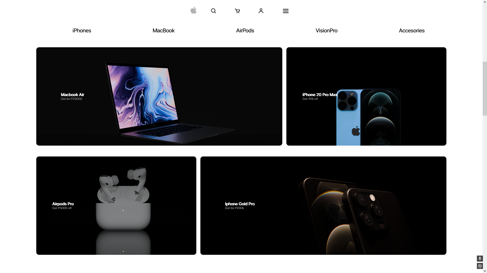
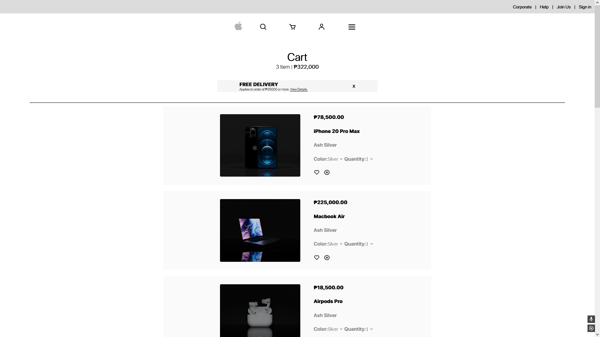

# ✨ Apple-Clone-ECommerce

Welcome to **Apple-Clone-ECommerce**, a modern and clean eCommerce platform inspired by Apple's website. This project showcases sleek design, semantic features, and seamless user experience, making it a perfect starting point template for any tech-related online store.

## 🚀 Demo

Check out the live demo of the project [here](https://cainmcrolan.github.io/Apple-Clone-ECommerce).

## 🔥 Features

- **Responsive Design**: Optimized for all devices.
- **Product Listings**: Browse through a variety of products.
- **Product Details**: Detailed view of each product.
- **Shopping Cart**: Add, remove, and manage products in your cart.
- **Checkout Process**: Secure and user-friendly checkout experience.

